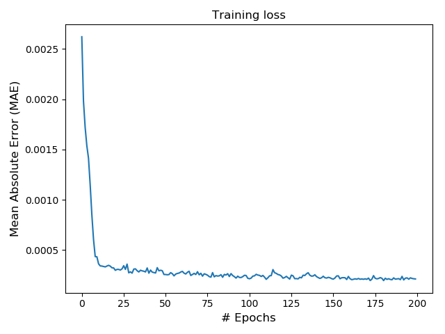
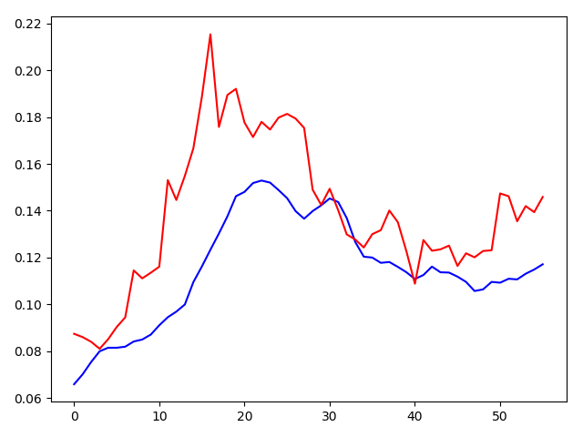

# 利用历史数据预测虚拟货币走势

数据来源：https://coinmarketcap.com

# 效果图

预测结果图，红色为实际曲线，蓝色为预测曲线，数据经过归一化

# 难题

如果用前7天的数据来预测今天的走势，会出现预测滞后问题。解决方法：在训练的时候将y设为4天后的数值，或者取未来7天的价格的平均数作为y，这样就可以减少预测滞后问题。

如果想提升模型性能，可以使用stacking方法，也可以从增加特征的方面出手，例如增加推特指数，搜索引擎指数等。

------

JUST FOR FUN, DO NOT USE IT IN REAL STOCKMARKET.